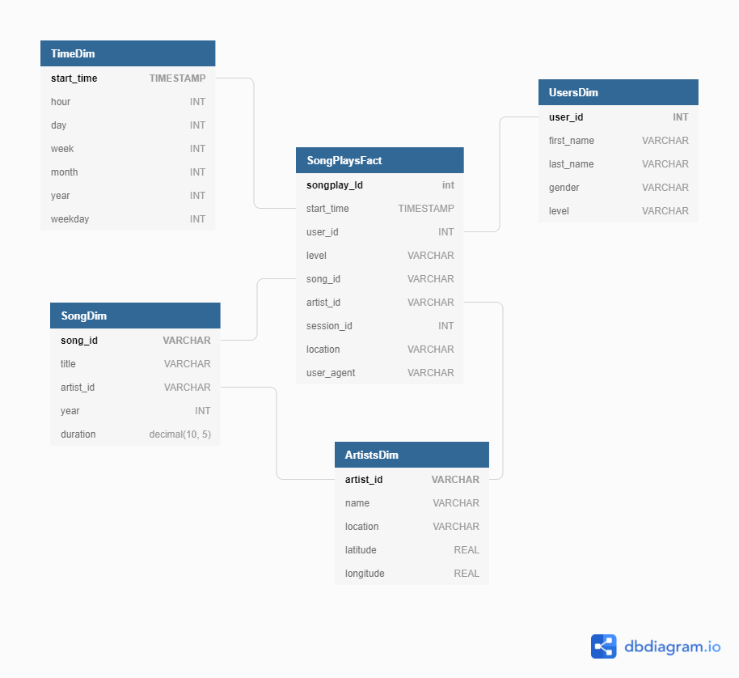

<h1> Sparkify relational data model design and ETL. </h1>
    
Sparkify star schema DB has been created on PostgreSQL, with accopanying Python ETL which loads both log and song .json files to FACT and DIM tables. 
    
<h2> Database Design </h2>
    
A start schema DB, Sparkify is made up of a FACT table and several DIM tables.
    

**SongPlaysFact** contains a unique serial Primary Key songplay_id, as well as all Foreign Keys to DIM tables, as well as the session_id.

songplay_Id|start_time|user_id|level|song_id|artist_id|session_id|location|user_agent
-----------|----------|-------|-----|-------|---------|----------|--------|---------
SERIAL PRIMARY KEY|BIGINT NOT NULL|INT NOT NULL|VARCHAR NOT NULL|VARCHAR|VARCHAR|INT NOT NULL|VARCHAR|VARCHAR
4108|2018-11-21 21:56:47.796000|15|paid|SOZCTXZ12AB0182364|AR5KOSW1187FB35FF4|818|Chicago-Naperville-Elgin, IL-IN-WI|"Mozilla/5.0 (X11; Linux x86_64) AppleWebKit/537.36 (KHTML, like Gecko) Ubuntu Chromium/36.0.1985.125 Chrome/36.0.1985.125 Safari/537.36"
   

    
**UsersDim** contains a unique Primary Key user_id and user data including price plan.
    
user_id|first_name|last_name|gender|level
-------|----------|---------|------|-----
INT PRIMARY KEY|VARCHAR NOT NULL|VARCHAR NOT NULL|VARCHAR NOT NULL|VARCHAR NOT NULL
92|Ryann|Smith|F|free
    

    
**SongsDim** contains a unique Primary Key song_id, a Foreign Key artist_id to the ArtistDim dimension, and details about songs.

song_id|title|artist_id|year|duration
-------|-----|---------|----|--------
VARCHAR PRIMARY KEY|VARCHAR NOT NULL|VARCHAR NOT NULL|INT|decimal(10, 5) NOT NULL
SOMZWCG12A8C13C480|I Didn't Mean To|ARD7TVE1187B99BFB1|0|218.93179
    

    
**ArtistsDim** contains a unique Primary Key artist_id and details about artists. 

artist_id|name|location|latitude|longitude
---------|----|--------|--------|-------
VARCHAR PRIMARY KEY|VARCHAR NOT NULL|VARCHAR|REAL|REAL
ARMJAGH1187FB546F3|The Box Tops|Memphis, TN|35.1497|-90.0489
    

    
**TimeDim** contains a unique Primary Key start_time and temporal information.

start_time|hour|day|week|month|year|weekday
----------|----|---|----|-----|----|-------
TIMESTAMP PRIMARY KEY|INT NOT NULL|INT NOT NULL|INT NOT NULL|INT NOT NULL|INT NOT NULL|INT NOT NULL
2018-11-30 00:22:07.796000|0|30|48|11|2018|4
    

    
Below is a ERD of Sparkify (made using dbdiagram.io).

    
<h2> Files </h2>

The data within this process is split into two files, the song file and the log file. 

**song files** contain infomration about songs and artists, and make up the songs and artists dimension tables.

**log files** log files contain a series of events from various users capturing who was listening to what, and when. 
    
<h2> ETL </h2>

Referencing sql_queries.py, create_tables.py creates the Sparkify DB, creates the fact and dim tables. Should these tables already exist, the script will drop and recreate them.
    
The etl.py script is broken into two functions, one to process song files, and another to process log files. These functions open .json files and attempt to insert (or in some cases update) all tables within Sparkify DB.

Steps: 
1. Execute the create_tables.py script.
2. Execute the etl.py scritp. 